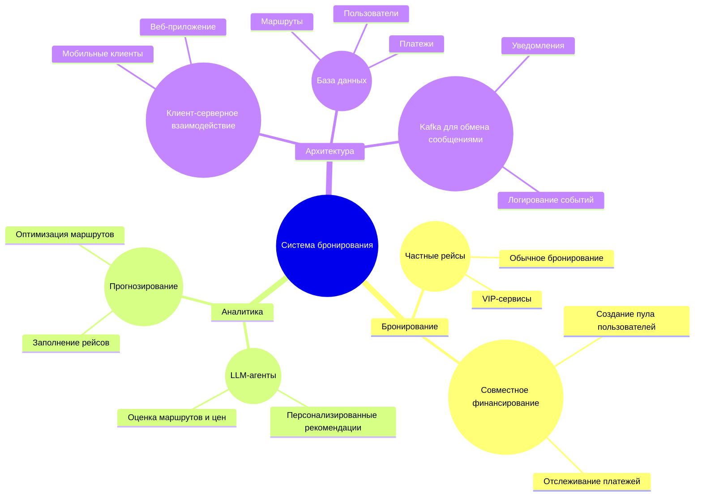
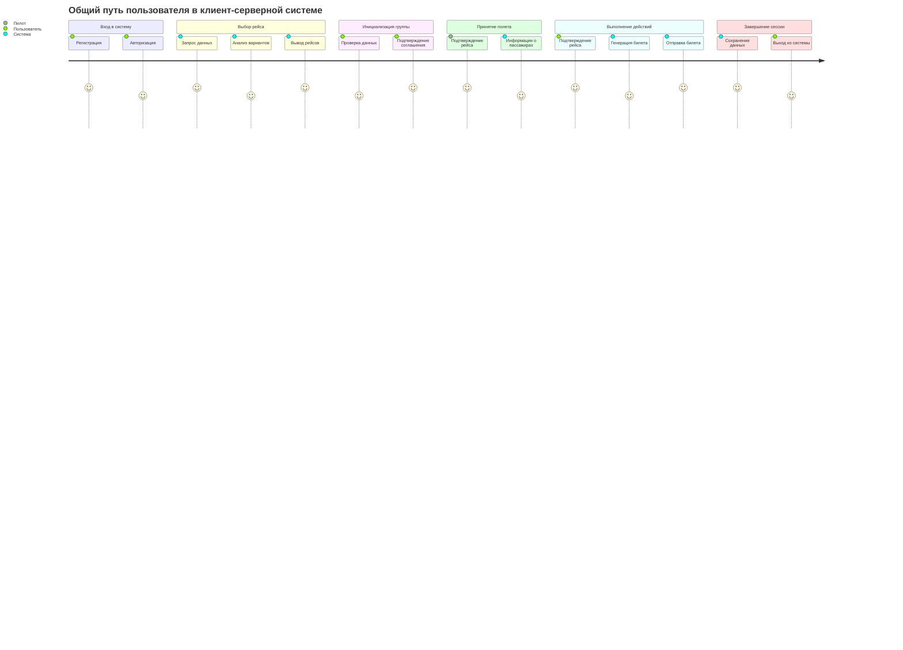
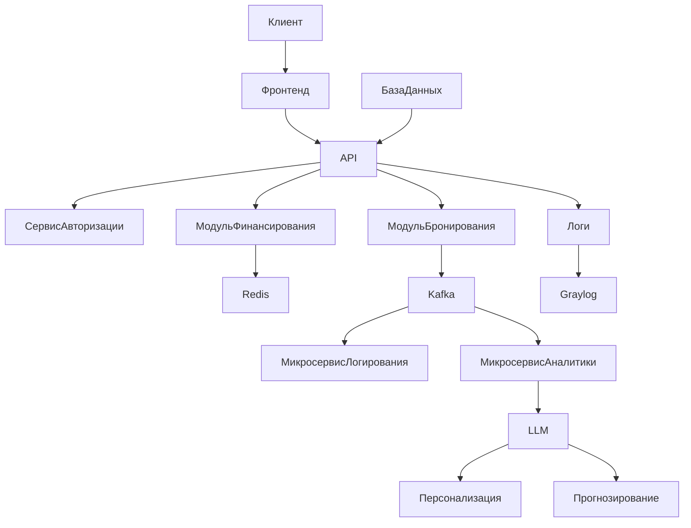
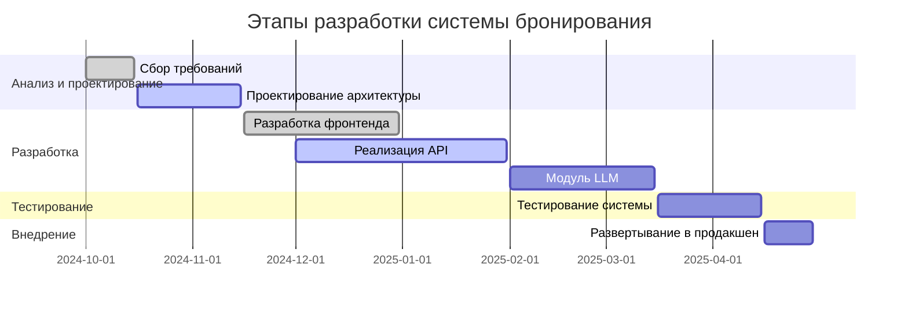
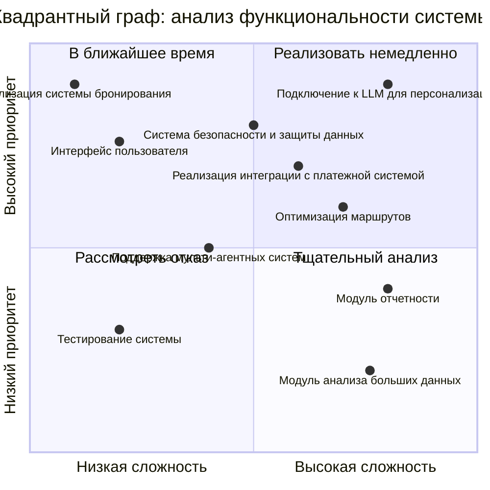
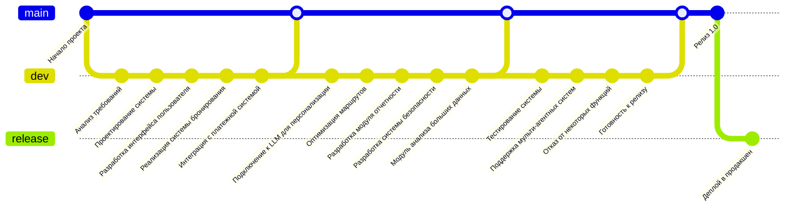

# Система бронирования частных перелетов

Этот документ описывает архитектуру, функциональность и ключевые аспекты разработки системы бронирования частных перелетов. Система поддерживает уникальные возможности, такие как совместное финансирование рейсов и использование мультиагентных систем на базе LLM для персонализированных рекомендаций и прогнозирования.
---

## 1. Структура функциональных возможностей

Данная диаграмма отображает основные функциональные модули системы, включая бронирование, аналитику, совместное финансирование и архитектуру.

---

## 2. Путешествие пользователя

Диаграмма показывает процесс взаимодействия пользователя с системой от регистрации до получения билета.

---

## 3. Архитектура системы

Диаграмма демонстрирует архитектуру системы, включая взаимодействие между модулями, кэшем, LLM и Kafka.

---

## 4. Этапы разработки (диаграмма Ганта)

План разработки включает этапы анализа, проектирования, реализации и тестирования системы.

---

## 5. Квадрант граф

## 6. Гит граф

**Описание:**  
Диаграмма описывает последовательность взаимодействий между клиентом, API, базой данных, LLM и Kafka.

---
